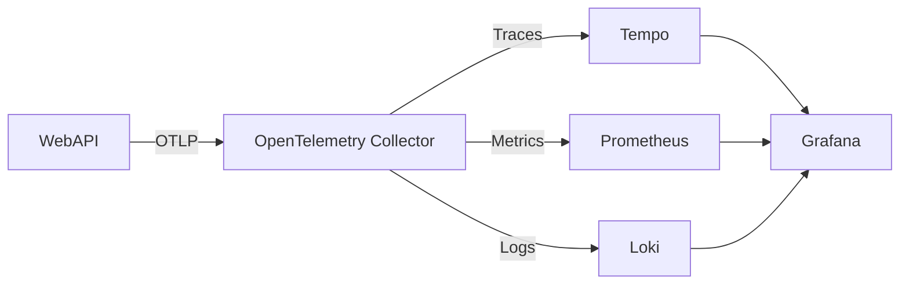

# 🚀 .NET 8 WebAPI with Observability Stack

A sample WebAPI project demonstrating `OpenTelemetry` integration with `Grafana LGTM stack (Loki, Grafana, Tempo, Mimir/Prometheus)` for complete observability - logs, metrics, and traces.

## ✨ Features

- `.NET 8 WebAPI` with Swagger/OpenAPI
- `Receives telemetry (metrics, logs, traces) from instrumented services, processes, exports to storage` with OpenTelemetry Collector 
- `Stores traces` with Grafana Tempo
- `Scrapes and stores metrics` with Prometheus 
- `Ingests and indexes logs` with Grafana Loki
- `Visualizes everything` with Grafana
- `OpenTelemetry auto-instrumentation`
- `Docker Compose` for local development

## 🧰 Prerequisites

- [.NET 8 SDK](https://dotnet.microsoft.com/download)
- [Docker Desktop](https://www.docker.com/products/docker-desktop/) or [Podman](https://podman.io/)
- [Git](https://git-scm.com/downloads)

## ⚡ Quick Start

1. Clone the repository
```bash
git clone https://github.com/sbroccardi/blog-01-observability-webapi-dotnet8
cd blog-01-observability-webapi-dotnet8
cd WebAPI
```

2. Start up the stack
```bash
docker compose up -d --build
```

Check the running containers:
```bash
docker compose ps
```

| NAME           | IMAGE                                       | COMMAND                | SERVICE        | CREATED       | STATUS                 | PORTS                                                                                                            |
|----------------|---------------------------------------------|------------------------|----------------|---------------|------------------------|------------------------------------------------------------------------------------------------------------------|
| grafana        | grafana/grafana:latest                      | "/run.sh"              | grafana        | 6 minutes ago | Up 5 minutes           | 0.0.0.0:3000->3000/tcp, [::]:3000->3000/tcp                                                                      |
| loki           | grafana/loki:latest                         | "/usr/bin/loki -conf…" | loki           | 6 minutes ago | Up 6 minutes (healthy) | 0.0.0.0:3100->3100/tcp, [::]:3100->3100/tcp                                                                      |
| otel-collector | otel/opentelemetry-collector-contrib:latest | "/otelcol-contrib --…" | otel-collector | 6 minutes ago | Up 5 minutes           | 0.0.0.0:4317-4318->4317-4318/tcp, [::]:4317-4318->4317-4318/tcp, 0.0.0.0:13133->13133/tcp, [::]:13133->13133/tcp |
| prometheus     | prom/prometheus:latest                      | "/bin/prometheus --c…" | prometheus     | 6 minutes ago | Up 6 minutes (healthy) | 0.0.0.0:9090->9090/tcp, [::]:9090->9090/tcp                                                                      |
| tempo          | grafana/tempo:latest                        | "/tempo -config.file…" | tempo          | 6 minutes ago | Up 6 minutes           | 0.0.0.0:3200->3200/tcp, [::]:3200->3200/tcp                                                                      |
| webapi         | webapi                                      | "dotnet WebAPI.dll"    | webapi         | 6 minutes ago | Up 5 minutes           | 0.0.0.0:8080->8080/tcp, [::]:8080->8080/tcp                                                                      |

3. Access the services
- WebAPI - Swagger UI: <http://localhost:8080/swagger>
- Grafana - UI (admin/admin): <http://localhost:3000>
- Prometheus - UI: <http://localhost:9090>
- Tempo - Build info: <http://localhost:3200/api/status/buildinfo>
- Tempo - Trace: <http://localhost:3200/api/traces/{traceid}>
- Loki - Build info: <http://localhost:3100/loki/api/v1/status/buildinfo>

> In Grafana, open the `.NET Observability` dashboard and use the `Loki` tab to explore logs with links to traces.
> You can also query `Tempo` metrics through the `Prometheus` data source.

4. Stop the stack
```bash
docker compose down -v
```

5. (Optional) Clean up unused Docker resources
```bash
docker system prune -f
```

## 🏗️ Architecture



## 📦 OpenTelemetry Packages

| Package | Purpose |
|---------|----------|
| `OpenTelemetry.Extensions.Hosting` | Core OpenTelemetry integration |
| `OpenTelemetry.Instrumentation.AspNetCore` | Auto-instrument ASP.NET Core |
| `OpenTelemetry.Instrumentation.Http` | Track outbound HTTP calls |
| `OpenTelemetry.Instrumentation.Runtime` | Collect runtime metrics |
| `OpenTelemetry.Instrumentation.Process` | Process-level telemetry |
| `OpenTelemetry.Exporter.OpenTelemetryProtocol` | OTLP export support |

## 🧑‍💻 Development

- Modify `otel-collector-config.yaml` to adjust telemetry processing.
- Modify `loki-config.yaml` to adjust Grafana Loki behavior.
- Modify `prometheus.yml` to adjust Prometheus scraping.
- Update Grafana dashboards in `grafana/dashboards/`.
- Configure data sources in `grafana/provisioning/`.

## 🩺 Troubleshooting

1. View container logs:
```bash
docker compose logs -f
```

2. Verify OpenTelemetry Collector:
```bash
docker compose logs otel-collector
```

## 📚 Official Documentation
- [OpenTelemetry SDK](https://opentelemetry.io/docs/languages/dotnet/)
- [OpenTelemetry Collector](https://opentelemetry.io/docs/collector/installation/)
- [Grafana](https://grafana.com/docs/grafana/latest/)
- [Grafana Dashboards](https://grafana.com/grafana/dashboards/)
- [Grafana Loki](https://grafana.com/docs/loki/latest/api/)
- [Grafana Tempo](https://grafana.com/docs/tempo/latest/api_docs/)
- [Prometheus](https://prometheus.io/docs/prometheus/latest/installation/)

## 🤝 Contributing

Contributions are welcome! Please:
1. Fork the repository
2. Create a branch for your feature (git checkout -b feature/AmazingFeature)
3. Commit your changes (git commit -m 'Add some AmazingFeature')
4. Push to the branch (git push origin feature/AmazingFeature)
5. Open a Pull Request

## 📄 License

This project is licensed under the terms of the MIT License. See the [LICENSE](LICENSE) file for details.
